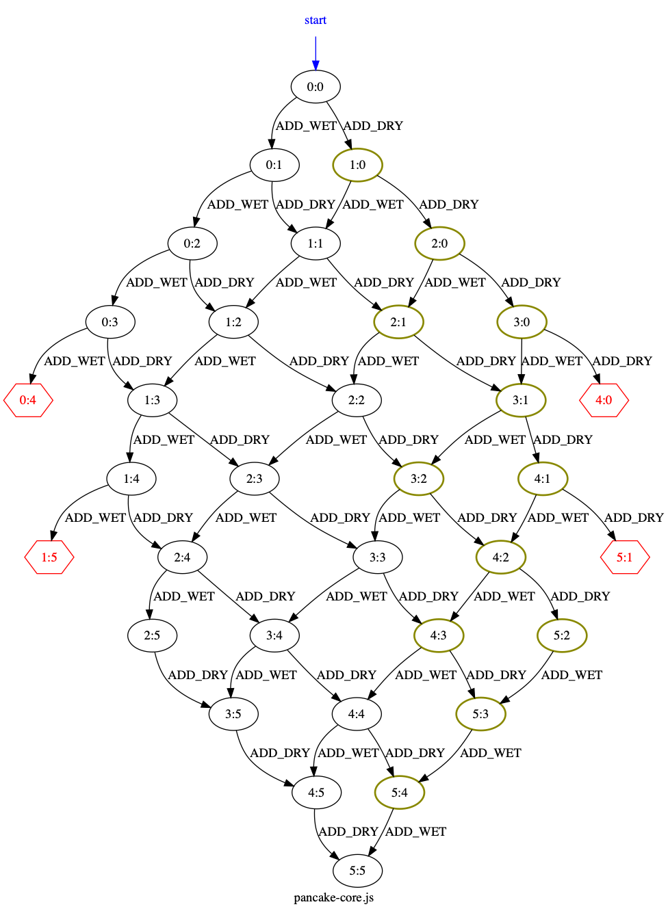

ifndef::env-github[:icons: font]
ifdef::env-github[]
:status:
:outfilesuffix: .adoc
:caution-caption: :fire:
:important-caption: :exclamation:
:note-caption: :page_with_curl:
:tip-caption: :bulb:
:warning-caption: :warning:
endif::[]
= BPjs State Space Mapper

[IMPORTANT]
The code in this repository captures the state of the application when it was used to generate figures for the paper. The StateSpaceMapper project is a separate project, whose repository is available link:https://github.com/bThink-BGU/StateSpaceMappe[here].

A very simple proof of concept program, for generating drawings of transition system of https://github.com/bthink-BGU/bpjs[BPjs] b-programs. The output of this program is in the Dot langauge; it relies on http://graphviz.org[Graphviz] to do the actual drawing. 

Node names are given by a b-thread called `stateTitler`. This b-thread passes the title in its sync statement data field.

[WARNING]
This is a *proof of concept*, not a well "engineered" tool. It may not work well if there are funky event names, or if the hash codes of the states collide. Use at your own risk.

.Transition System of a link:WORK/pancake-core.js[b-program]. Nodes with violations are hexagons. Hot nodes have thicker border and are dark yellow.

== Usage

Basically, you want to run the main class `il.ac.bgu.cs.bp.statespacemapper.SpaceMapperRunner` and provide it with paths to the source files of the b-program. The program will output a 
representation of the b-program's state-space/transition system using the *dot* language.

As an aside, the mapper will output the details of each b-thread in each synchronization point to `stderr`. These will include the hash of the synchronization point, and for each b-thread: its name, current line number, and synchronization statement.

=== Building the mapper

This is a https://maven.apache.org[Maven] project. You'll need Maven installed, or a Java IDE that supports Maven (http://netbeans.apache.org[e.g. NetBeans]). 

To build a self-contained version of StateSpaceMapper (i.e. with all dependencies bundled in it), run `mvn package -P uber-jar` using your platform's terminal
application. This will generate an executable `.jar` file in the `target` directory.

=== Running the mapper

[code, bash]
------
./java -jar path-to-StateSpaceMapper.jar file1.js file2.js ... filen.js
------

Normally you'd want to redirect Java's `stdout` to Graphviz for drawing:

[code, bash]
------
./java -jar path-to-StateSpaceMapper.jar file1.js file2.js ... filen.js | dot -Tpdf > my-prog.pdf
------

You can also direct it to a file, for later manual manipulation:

[code, bash]
------
./java -jar path-to-StateSpaceMapper.jar file1.js file2.js ... filen.js > my-prog.gv
------

